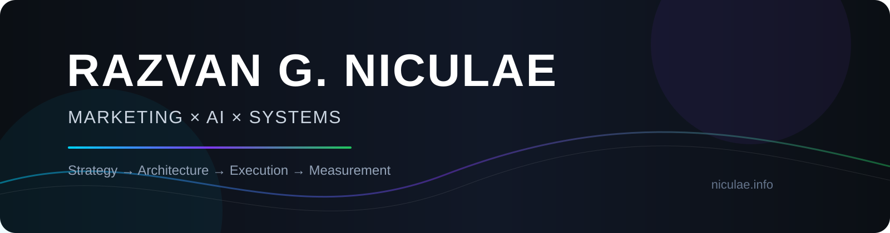

<div align="center">



<br/>

### Marketing & AI Transformation Executive
**Growth · MarTech · Applied AI · Automation · Full-Stack Systems**

I connect business strategy with hands-on technology — building marketing systems,
AI workflows, automation and digital products designed for measurable growth.

[](https://www.niculae.info/)
[](https://www.linkedin.com/in/nick3o/)

</div>

---

## 👋 About Me

I work at the intersection of **marketing leadership, business growth and technology**.

Over 18+ years, my work has evolved from traditional and digital marketing into
**performance marketing, MarTech, software systems, automation and applied AI**.

Today, I focus on turning strategy into working systems:

- 🤖 **AI Transformation & Automation** — practical AI workflows, context engineering, tool-integrated AI and human-in-the-loop systems.
- 📈 **Growth & Performance Marketing** — acquisition, conversion, attribution, ROAS/ROI and omnichannel growth.
- 🔎 **SEO · AEO · GEO · Generative Discovery** — visibility across traditional search and AI-first discovery ecosystems.
- ⚙️ **MarTech & Marketing Engineering** — analytics, tracking, APIs, automation, CRM workflows and data integration.
- 💻 **Full-Stack Systems** — prototyping and building practical digital products, internal tools and SaaS-oriented platforms.
- 🧩 **Strategy → Architecture → Execution** — connecting executive thinking with hands-on implementation.

> **Technology is useful when it creates measurable business leverage.**

---

## 🚀 Current Focus

### 🤖 Applied AI & Intelligent Workflows

Designing structured AI systems that combine:

`Context Engineering` · `Tool Integration` · `Automation` · `Validation`
· `Human Oversight` · `Multi-step Workflows`

My interest is in making generative AI **useful, controlled and operational** —
not simply adding another chatbot to a business.

### 🔍 Generative Search & Discovery

Exploring how brands and products are discovered across both classical and
AI-native environments:

`SEO` · `SEM` · `AEO` · `GEO` · `LLM SEO` · `Structured Data`
· `Google AI Overviews` · `ChatGPT` · `Claude` · `Gemini` · `Perplexity`

### 🛠 Marketing Engineering

Connecting growth strategy to the infrastructure required to execute it:

`Analytics` · `Attribution` · `Tracking` · `APIs` · `Data Pipelines`
· `Marketing Automation` · `CRO` · `CMS` · `Cloud`

---

## 🌟 Selected Work

### 🎨 Picasso — Claude Design ↔ Claude Code Bridge Loop

A local orchestration loop for turning a design brief into implementation through a
structured **Generate → Implement → Score → Refine** workflow.

**Focus:** design systems · AI orchestration · Claude Code · automation · iterative quality gates

👉 [View repository](https://github.com/RazvanGabrielNiculae/picasso-claude-design-claude-code-bridge-loop)

---

## 🧰 Technology & Platforms

### Development & Systems


### Marketing, Growth & Experience

`Google Ads` · `Meta Ads` · `LinkedIn Ads` · `TikTok Ads`
· `GA4` · `GTM` · `SEO` · `AEO` · `GEO`
· `WordPress` · `Magento` · `PrestaShop` · `Shopify`
· `Figma` · `UX/UI`

---

## 🧠 How I Think

```text
BUSINESS OBJECTIVE
        ↓
STRATEGY
        ↓
SYSTEM ARCHITECTURE
        ↓
DATA + AUTOMATION + AI
        ↓
EXECUTION
        ↓
MEASUREMENT
        ↓
ITERATION
```

I believe the strongest solutions happen when **business strategy, marketing,
data and engineering are designed together rather than treated as separate disciplines**.

---

## 🌐 Beyond GitHub

My broader professional work, background and capabilities:

### 👉 [www.niculae.info](https://www.niculae.info/)

The website represents the broader picture.

**GitHub is where I document the systems, experiments, engineering and applied-AI work behind it.**

---

<div align="center">

### Strategy × Marketing × AI × Technology

[**niculae.info**](https://www.niculae.info/) ·
[**LinkedIn**](https://www.linkedin.com/in/nick3o/)

</div>
